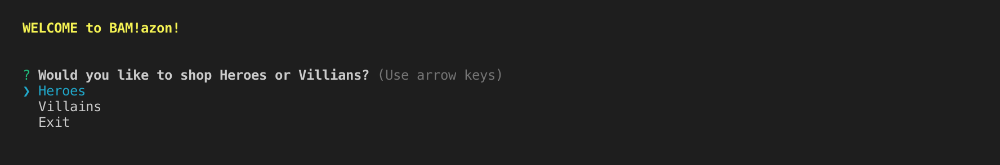
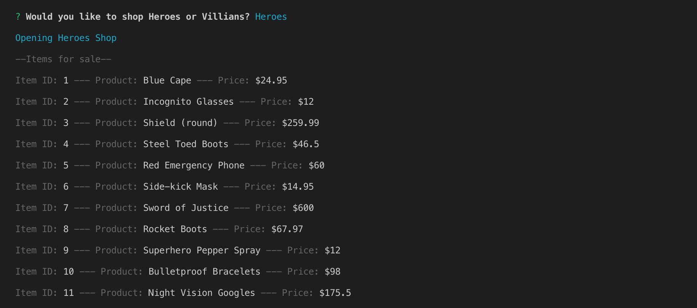
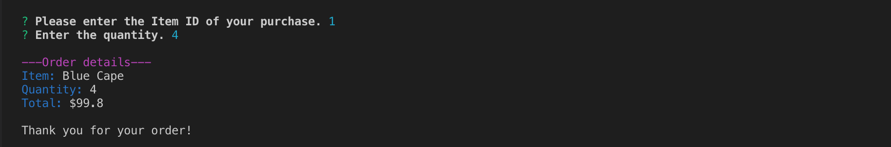
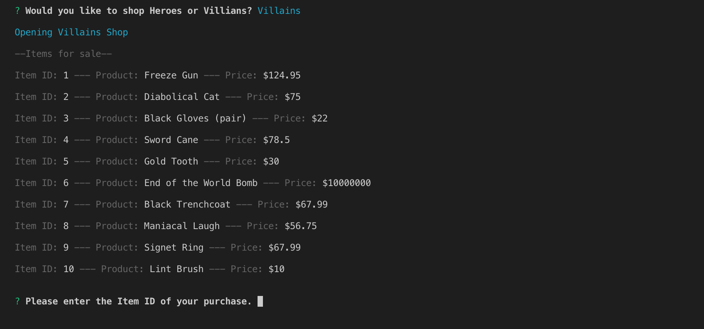
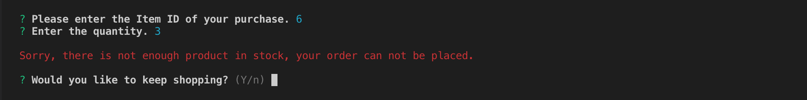
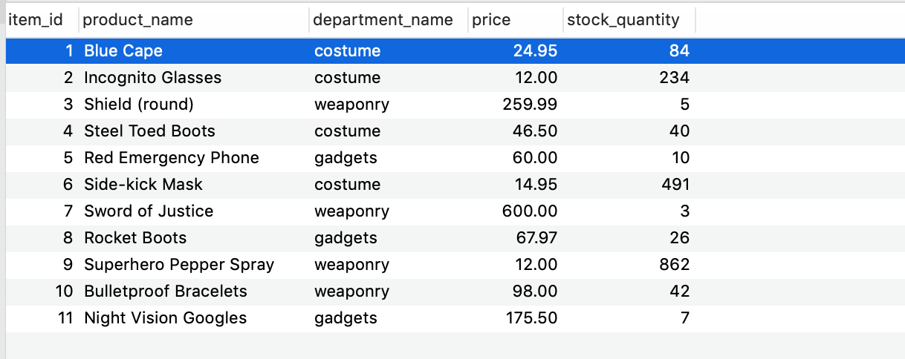
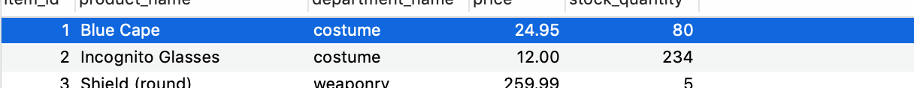
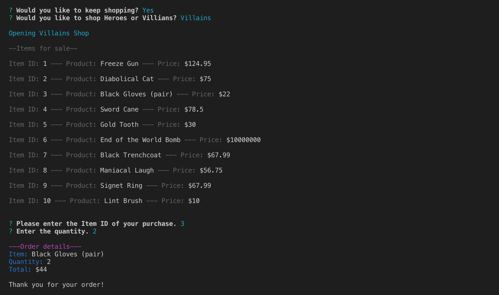
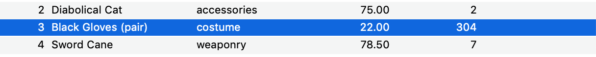
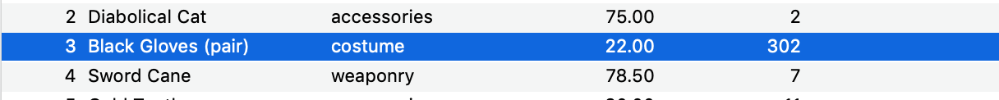

# BAM!azon
CLI app using node.js and mysql to create an online store

### Welcome, Dear Patrons
BAM!azon is a command line store serving both heroes and villains. 

If you would like to use it in your own command line you can create your own product database using the code in the 'schema.sql' file. This application also requires you to install some npm packages:
* MySQL (to retrieve and update product info)
* Inquirer (to prompt customers and get input)
* Colors (to create contrast within the text and make it more readable)

## HOW IT FUNCTIONS
### The Purchasing Process
Upon entering the application you will be asked which shop you would like to view; "Heroes" or "Villains". If you are broke there is a third option called "Exit". 

When your choice has been made the inventory for your chosen shop will be displayed. 

Once you have decided what you would like to buy you will be prompted for the Item ID and the desired quantity. 

Your order will be completed and you will be given a message which displays:
* Product_Name
* Quantity
* Total Price

#### Now, let's take a look at the Villain Shop.

Say, you want to purchase Item 6, the End of the World Bomb. When you try to order 3 of the item you will see this message.

There is, of course, only *one* End of the World Bomb in stock and luckily no one has purchased it yet. So if there is not enough product in stock, you will be notified by a message and asked if you would like to continue shopping. 

If you would like to purchase another item or quantity select yes. You will be prompted to choose your shop so that items will be dispalyed again and you may select a new product.  

## BEHIND THE SCENES
As users are making purchases the inventory is being updated in the database. 

The new stock quantity updates when the 4 Blue Capes from the previous Hero purchase are successfully ordered.

#### Let's see it in action in the Villain Shop
Upon not being able to purchase the 3 bombs, a villain has opted to buy 2 pairs of black gloves instead. 

The inventory is updated.

